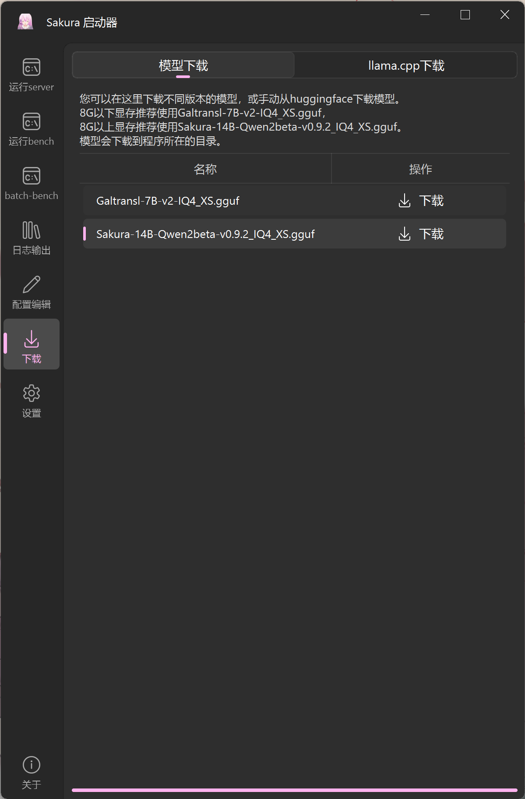
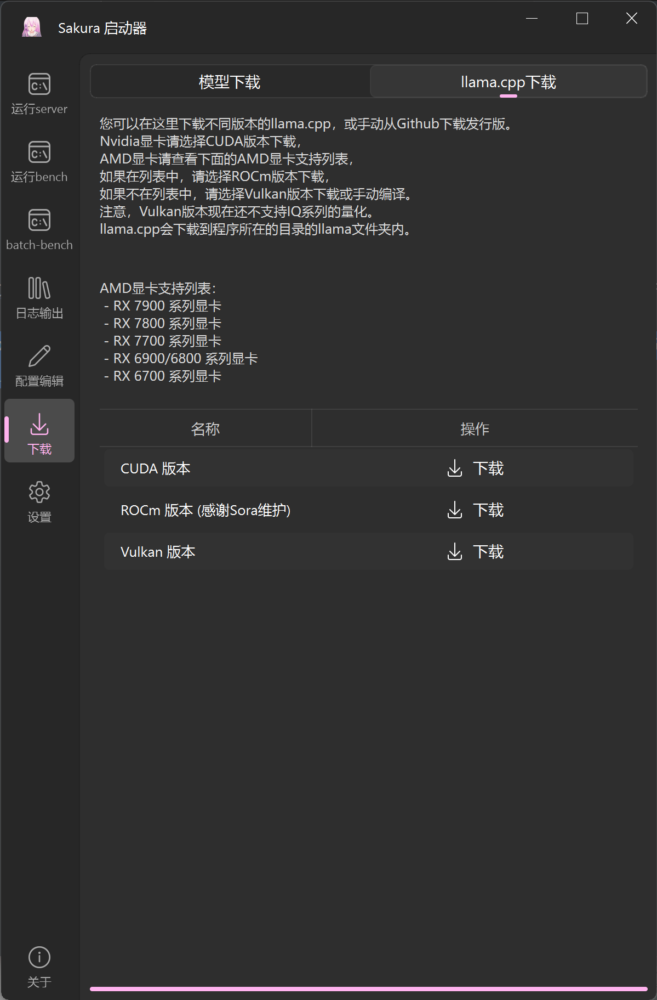
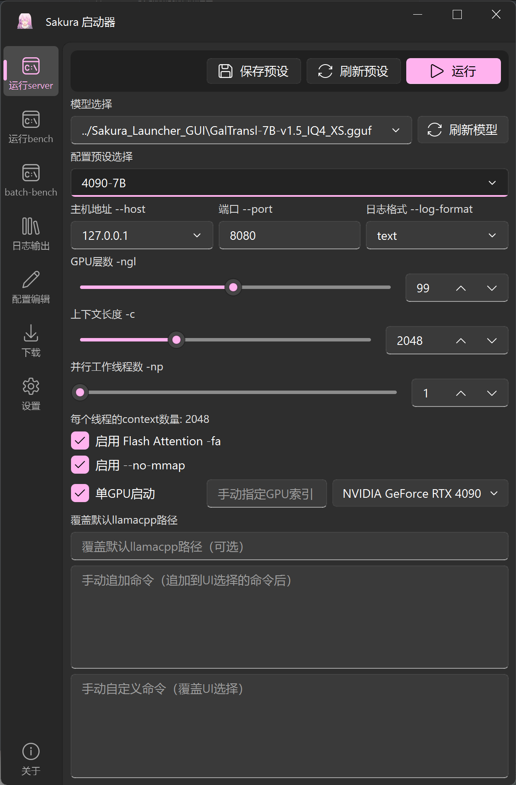

# Sakura Launcher GUI 用户手册（过时，请耐心等待更新）

## 0. 简介

Sakura Launcher GUI 是一个用于启动和管理SakuraLLM相关任务的图形界面工具（当然，也可以用来启动其他的llamacpp支持的LLM）。本手册将详细指导您如何使用该工具的各项功能，包括运行server、执行基准测试、管理配置、下载资源等。

## 1. 快速上手

双击打开程序，点击左边的"下载"按钮。在模型下载界面选择适合你的显存的模型进行下载，请耐心等待下方进度条走完并提示下载完成。

点击右上角的llama.cpp下载，仔细阅读说明，下载适合你的显卡的llamacpp版本进行下载，请耐心等待下方进度条走完并提示下载完成、解压完成。

返回运行server界面，直接点击"运行"。

现在，你可以在需要使用sakura的工具，如[轻小说机翻机器人](https://books.fishhawk.top/)、[GalTransl](https://github.com/xd2333/GalTransl)、[BallonsTranslator](https://github.com/dmMaze/BallonsTranslator)中填入你设置好的地址开始使用了。

***如果你使用的是7000系AMD CPU和AMD独立显卡，有概率会出现错误地启动在核显上的情况。如果你遇到这个问题，请查看下方的"2.1.6 GPU设置"这一节。***

## 2. 完整功能介绍

### 2.1 运行server

#### 2.1.1 模型选择
- 点击"刷新模型"按钮以更新可用模型列表
- 从下拉菜单中选择要使用的模型文件
- 可以手动输入模型路径

#### 2.1.2 配置预设
- 从下拉菜单中选择已保存的配置预设
- 点击"保存预设"按钮保存当前配置
- 点击"刷新预设"按钮更新预设列表

#### 2.1.3 服务器设置
- 主机地址（--host）：设置服务器监听的IP地址，默认为127.0.0.1，如需非本机访问，可以选择0.0.0.0
- 端口（--port）：设置服务器监听的端口，默认为8080
- 日志格式（--log-format）：选择日志输出格式，为旧版llamacpp设计，新版不支持该选项，默认为none

#### 2.1.4 模型参数
- GPU层数（-ngl）：设置在GPU上运行的层数，范围0-200
  - 设为0则为纯CPU运行

- 上下文长度（-c）：设置模型的上下文长度，范围256-131072
  - 对于即时翻译任务，如[LunaTranslator](https://github.com/HIllya51/LunaTranslator)，每个线程的上下文长度不应当小于512
  - 对于翻译工具，如[GalTransl](https://github.com/xd2333/GalTransl)或[轻小说机翻机器人](https://books.fishhawk.top/)，每个线程的上下文长度不应当小于1536
- 并行工作线程数（-np）：设置并行处理的线程数，范围1-32
  - 设置线程大于1时，context数量将会平均分配给每个线程。程序会自动计算实际上每个线程的上下文长度，并显示在UI上，请注意查看
    - 

#### 2.1.5 优化选项
- 启用Flash Attention（-fa）：勾选以启用Flash Attention优化
  - 在低np下小幅度优化PP速度，对TG速度影响不大

- 启用--no-mmap：勾选以禁用内存映射加载模型
  - 不将模型映射到内存中，减少内存占用

#### 2.1.6 GPU设置
- 单GPU启动：勾选以启用GPU
- 手动指定GPU索引：可以手动输入GPU索引
- GPU选择：从下拉菜单中选择要使用的GPU
  - 会自动识别所有存在的NVIDIA、AMD显卡，并列表显式。
    - 对于N卡，直接选择你需要的GPU即可。如果需要多显卡，请单GPU启动或使用"手动指定GPU索引"。
    - 对于A卡，由于缺少类似nvidia-smi的工具，获取的显卡顺序可能会出错。如果llamacpp启动的显卡不正确，如启动在了核显上，请使用上方的"手动指定GPU索引"来手动指定HIP_VISIBLE_DEVICES。对于一般的AMD 7000系CPU+AMD独立显卡用户，在左边输入0、1进行尝试即可

#### 2.1.7 高级选项
- 覆盖默认llamacpp路径：可以指定自定义的llamacpp可执行文件路径，会保存在配置预设中，优先级高于设置中的llamacpp。
- 手动追加命令：在此输入框中添加其他命令行参数
- 手动自定义命令：完全自定义命令行，覆盖GUI选择的所有选项

### 2.2 运行bench

- 与server相同

### 2.3 批量运行bench

#### 2.3.1 模型选择
- 与运行server相同

#### 2.3.2 配置预设
- 与运行server相同

#### 2.3.3 模型参数
- GPU层数（-ngl）：设置在GPU上运行的层数，范围0-200
- 最大上下文长度（-c）：设置模型的最大上下文长度，范围1-65535

#### 2.3.4 批量测试参数
- Prompt数量（-npp）：设置测试的Prompt数量，多个值用英文逗号分隔
- 生成文本数量（-ntg）：设置生成的文本数量，多个值用英文逗号分隔
- 并行Prompt数量（-npl）：设置并行处理的Prompt数量，多个值用英文逗号分隔

#### 2.3.5 优化选项
- Prompt共享（-pps）：勾选以启用Prompt共享
- 启用Flash Attention（-fa）：勾选以启用Flash Attention优化
- 启用--no-mmap：勾选以禁用内存映射加载模型

#### 2.3.6 GPU设置
- 与运行server相同

#### 2.3.7 高级选项
- 与运行server相同

### 2.4 日志输出

- 实时显示运行日志
- 清空日志：点击"清空日志"按钮清除当前显示的所有日志

### 2.5 配置编辑

#### 2.5.1 Server配置
- 显示所有保存的server配置预设
- 可以上移、下移或删除配置预设
- 长按上移或下移按钮可快速移动到顶部或底部

#### 2.5.2 Bench配置
- 显示所有保存的bench配置预设
- 操作方式与Server配置相同

#### 2.5.3 保存和加载
- 保存配置预设：点击"保存配置预设"按钮保存当前所有配置
- 加载配置预设：点击"加载配置预设"按钮加载保存的配置

### 2.6 下载

#### 2.6.1 模型下载
- 提供常用模型的下载链接
- 点击"下载"按钮开始下载选定的模型
- 下载进度显示在界面底部的进度条上

#### 2.6.2 llama.cpp下载
- 提供不同版本的llama.cpp下载链接（CUDA版本、ROCm版本、Vulkan版本）
- 点击"下载"按钮开始下载选定的llama.cpp版本
- 下载完成后会自动解压到程序所在目录的llama文件夹，并覆盖原有文件。
- 请直接在GUI中查看详细说明

### 2.7 设置

#### 2.7.1 llama.cpp路径
- 设置llama.cpp二进制文件所在的路径
- 如果留空，则默认为当前目录下的llama文件夹

#### 2.7.2 模型搜索路径
- 设置模型文件的搜索路径
- 每行输入一个路径
- 程序会在这些路径中搜索模型文件

#### 2.7.3 记住窗口位置和大小
- 勾选以记住窗口的位置和大小

#### 2.7.4 模型排序方式
- 选择模型列表的排序方式，包括修改时间、文件名和文件大小

#### 2.7.3 保存和加载
- 保存设置：点击"保存设置"按钮保存当前设置
- 加载设置：点击"加载设置"按钮加载保存的设置

### 2.8 关于

- 显示软件版本信息
- 提供SakuraLLM项目地址链接
- 提供Sakura Launcher GUI项目地址链接

### 2.9 共享
- 上线：开始共享
- 下线：停止共享
- 保存：保存自定义的worker url
- 刷新在线数量：刷新当前在线的slot数量和状态
- WORKER_URL：自定义自行部署的worker url（不推荐）
- 关于共享功能的说明，请查看：[sakura-share](https://github.com/1PercentSync/sakura-share)

## 3. 使用指南

### 3.1 运行server

1. 在左侧导航栏选择"运行server"
2. 点击"刷新模型"按钮更新可用模型列表
3. 从下拉菜单中选择要使用的模型文件
4. 设置服务器地址、端口和日志格式
5. 调整GPU层数、上下文长度和并行线程数
6. 根据需要启用Flash Attention和no-mmap选项
7. 选择GPU并设置GPU索引（如有需要）
8. 如有特殊需求，可以在高级选项中追加或自定义命令
9. 点击"运行"按钮启动服务器

### 3.2 运行bench

1. 在左侧导航栏选择"运行bench"
2. 选择模型文件（步骤同运行server）
3. 设置GPU层数
4. 根据需要启用Flash Attention和no-mmap选项
5. 选择GPU并设置GPU索引（如有需要）
6. 如有特殊需求，可以在高级选项中追加或自定义命令
7. 点击"运行"按钮开始基准测试

### 3.3 批量运行bench

1. 在左侧导航栏选择"batch-bench"
2. 选择模型文件（步骤同运行server）
3. 设置GPU层数和最大上下文长度
4. 输入Prompt数量、生成文本数量和并行Prompt数量（多个值用逗号分隔）
5. 根据需要启用Prompt共享、Flash Attention和no-mmap选项
6. 选择GPU并设置GPU索引（如有需要）
7. 如有特殊需求，可以在高级选项中追加或自定义命令
8. 点击"运行"按钮开始批量基准测试

### 3.4 查看和管理日志

1. 在左侧导航栏选择"日志输出"
2. 查看实时运行日志
3. 需要清空日志时，点击"清空日志"按钮

### 3.5 管理配置预设

1. 在左侧导航栏选择"配置编辑"
2. 选择Server或Bench标签页
3. 使用上移、下移按钮调整配置预设顺序
4. 使用删除按钮移除不需要的配置预设
5. 点击"保存配置预设"按钮保存更改

### 3.6 下载资源

1. 在左侧导航栏选择"下载"
2. 在"模型下载"部分，选择需要的模型并点击"下载"
3. 在"llama.cpp下载"部分，选择适合您GPU的版本并点击"下载"
4. 观察底部进度条了解下载进度
5. 下载完成后，llama.cpp会自动解压到指定目录

### 3.7 修改设置

1. 在左侧导航栏选择"设置"
2. 在"llama.cpp 文件夹"输入框中设置llama.cpp的路径
3. 在"模型搜索路径"文本框中添加模型文件的搜索路径（每行一个）
4. 在"模型排序方式"下拉菜单中选择模型列表的排序方式
5. 在"记住窗口位置和大小"复选框中勾选以记住窗口的位置和大小
6. 点击"保存设置"按钮保存更改
7. 需要时可以点击"加载设置"按钮恢复之前保存的设置

### 3.8 关于

1. 在左侧导航栏选择"关于"
2. 查看软件版本信息

### 3.9 共享

1. 在左侧导航栏选择"共享"
2. 点击"上线"按钮开始共享
3. 输入自定义的worker url（不推荐）
4. 点击"保存"按钮保存自定义的worker url
5. 点击"刷新在线数量"按钮刷新当前在线的slot数量和状态

## 4. 注意事项

- 使用GPU功能时，请确保已正确安装GPU驱动
- NVIDIA显卡用户请选择CUDA版本的llama.cpp
- AMD显卡用户请根据显卡型号选择ROCm版本或Vulkan版本的llama.cpp
- 下载大文件（如模型文件）时可能需要较长时间，请保持耐心
- 如遇到问题，请查看日志输出以获取详细信息
- 定期备份您的配置预设，以防意外丢失

## 5. 技术支持

如需进一步帮助或报告问题，请访问以下项目地址：

模型相关：

- SakuraLLM: https://github.com/SakuraLLM/SakuraLLM

GUI相关：

- Sakura Launcher GUI: https://github.com/PiDanShouRouZhouXD/Sakura_Launcher_GUI

您可以在这些项目的Issues页面提出问题或建议，或者查看已有的讨论以寻找解决方案。
