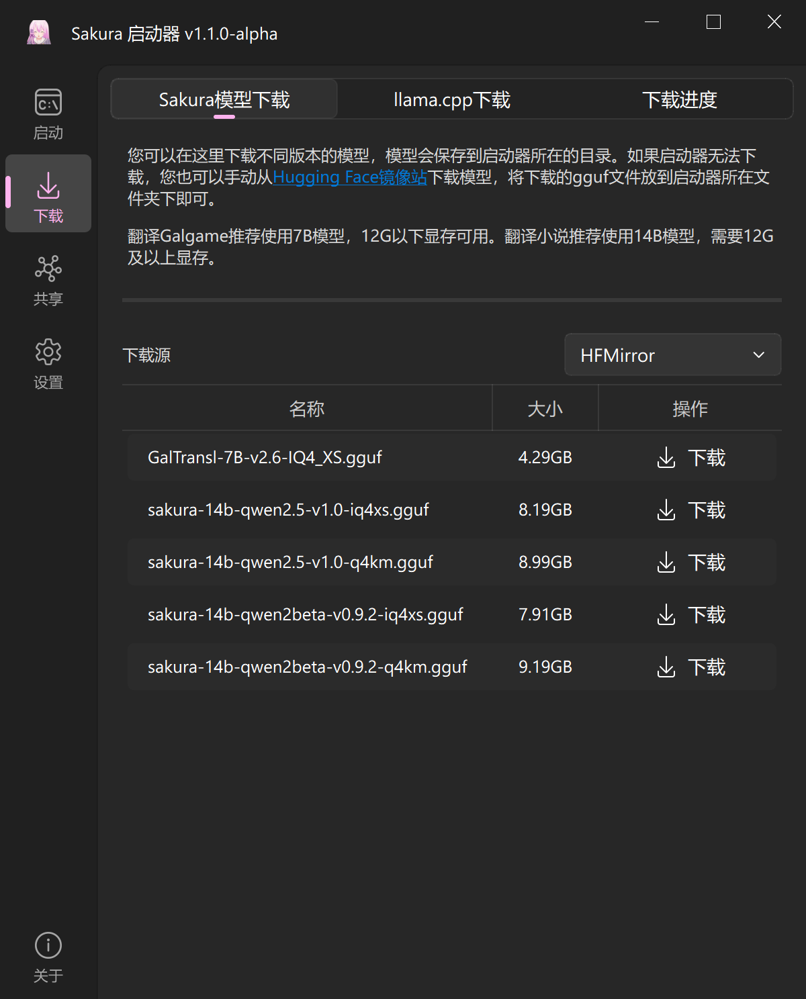

# Sakura Launcher GUI 用户手册

## 0. 简介

Sakura Launcher GUI 是一个用于启动和管理SakuraLLM相关任务的图形界面工具（当然，也可以用来启动其他的llama.cpp支持的LLM）。

本手册将详细指导您如何使用该工具的各项功能，包括启动llama-server、运行llama-batched-bench、下载资源、管理配置、共享等。

## 1. 快速上手

这一节将指导你如何快速上手使用Sakura Launcher GUI。

双击打开程序，点击左边的`下载`按钮。

认真阅读说明，选择适合你的显卡的Sakura版本，并点击`下载`按钮进行下载。
你可以在`下载进度`中查看下载进度。

然后，切换到`llama.cpp下载`界面，点击`下载`按钮，认真阅读说明，并点击`下载`按钮进行下载。

返回`启动`界面，直接点击`启动`。

如果遇到网络问题导致下载失败，你可以：
1. 清理已下载的失败文件后重新下载
2. 手动下载模型文件和llama.cpp，然后在程序中设置对应路径

现在，你可以在需要使用sakura的工具，如[轻小说机翻机器人](https://books.fishhawk.top/)、[GalTransl](https://github.com/xd2333/GalTransl)、[BallonsTranslator](https://github.com/dmMaze/BallonsTranslator)中填入你设置好的地址开始使用了。

如果你遇到了警告弹窗，请按照弹窗提示的解决方案进行操作。

***如果你使用的是7000系AMD CPU和AMD独立显卡，有概率会出现错误地启动在核显上的情况。如果你遇到这个问题，请查看下方的"2.1.2 GPU设置"这一节。***

## 2. 高级设置

### 2.1 启动页面高级设置

#### 2.1.1 模型参数和自动配置

- 对于不了解模型参数的用户，可以点击`自动配置`按钮，程序会根据你选择的模型，自动设置合适的参数。自动配置**仅支持**存在于`下载`页面中的模型。

- 上下文长度（-c）：设置模型的上下文长度，范围256-131072
  - 对于即时翻译任务，如[LunaTranslator](https://github.com/HIllya51/LunaTranslator)，每个线程的上下文长度不应当小于512
  - 对于翻译工具，如[GalTransl](https://github.com/xd2333/GalTransl)或[轻小说机翻机器人](https://books.fishhawk.top/)，每个线程的上下文长度不应当小于1536
- 并行工作线程数（-np）：设置并行处理的线程数，范围1-32
  - 设置线程大于1时，context数量将会平均分配给每个线程。程序会自动计算实际上每个线程的上下文长度，并显示在UI上，请注意查看
    - 

#### 2.1.2 GPU设置和自定义命令
- GPU选择：从下拉菜单中选择要使用的GPU
  - 会自动识别所有存在的NVIDIA、AMD显卡，并列表显示。
    - 对于N卡，直接选择你需要的GPU即可。如果需要多显卡，请选择`自动`。如果需要指定某些显卡，请在下方的自定义命令中输入： `CUDA_VISIBLE_DEVICES=a,b,c %cmd%`，其中a,b,c为显卡序号，从0开始，%cmd%为GUI设置的启动命令。
    - 对于A卡，由于缺少类似nvidia-smi的工具，获取的显卡顺序可能会出错。如果llamacpp启动的显卡不正确，如启动在了核显上，请在下方的自定义命令中输入： `HIP_VISIBLE_DEVICES=x %cmd%`，其中x为显卡序号，可以尝试0、1，%cmd%为GUI设置的启动命令。
- 自定义命令：
  - `%cmd%`会被替换为GUI生成的完整启动命令，
  - `%cmd_raw%` 会替换成GUI生成的命令和模型选项，但不包括其他选项。

#### 2.1.3 性能测试
- 点击`性能测试`按钮，程序会自动运行llama-batched-bench，并显示测试结果。
- 其中，`Prompt数量`为测试的Prompt数量，`生成文本数量`为每个Prompt生成的文本数量，`并行Prompt数量`为并行处理的Prompt数量，也就是线程数。一般推荐使用默认配置的参数，并查看最终的S_TG输出，以确定合适的参数。

### 2.2 共享
- 上线：开始共享
- 下线：停止共享
- 刷新在线数量：刷新当前在线的slot数量和状态
- 链接：自定义自行部署的worker url（不推荐）
- 令牌：设置共享的令牌，用于累计共享信息，参加在线排行榜 （在当前版本中1.1.0中，由于服务端想逛功能尚未开发，所以**无法使用**）
- 本地数据统计：查看本地共享数据，包含所有的请求数据，未区分本地使用和共享
- share工具的[API](https://github.com/PiDanShouRouZhouXD/Sakura_Launcher_GUI/blob/main/src/sakura_share_api.py)是与GUI完全解耦的，并另外提供了[CLI工具](https://github.com/PiDanShouRouZhouXD/Sakura_Launcher_GUI/blob/main/src/sakura_share_cli.py)，如有需要，可以脱离GUI使用。
- 关于共享功能的说明，请查看：[sakura-share](https://github.com/1PercentSync/sakura-share)

### 2.3 设置页面功能
- 记住窗口位置和大小：启动器会记住上次关闭时的窗口位置和大小
- 记住高级设置状态：记住启动页面中高级设置面板的展开/折叠状态
- 关闭 GPU 能力检测：关闭启动时的GPU显存检查功能
- 关闭每线程上下文长度检查：关闭对每个线程最小上下文长度的检查
- 模型列表排序：可选择按"修改时间"、"文件名"或"文件大小"对模型列表进行排序
- llama.cpp文件夹：可手动指定llama.cpp的安装路径
- 模型搜索路径：可添加多个模型搜索路径，每行一个路径（默认包含当前目录），将会遍历所有子目录

### 2.4 配置预设功能
- 预设可以上下移动调整顺序，支持删除操作
- 长按向上/向下箭头可以快速移动预设

### 2.5 日志功能
- 程序运行过程中的重要信息会记录在日志中
- 可以在设置页面的"日志输出"标签页查看
- 支持清空日志功能

### 2.6 自动更新
- 程序会自动检查新版本
- 可以在设置页面手动检查更新
- 发现新版本时会提示下载更新

## 3. 技术支持

如需进一步帮助或报告问题，请访问以下项目地址：

模型相关：

- SakuraLLM: https://github.com/SakuraLLM/SakuraLLM

GUI相关：

- Sakura Launcher GUI: https://github.com/PiDanShouRouZhouXD/Sakura_Launcher_GUI

您可以在这些项目的Issues页面提出问题或建议，或者查看已有的讨论以寻找解决方案。
